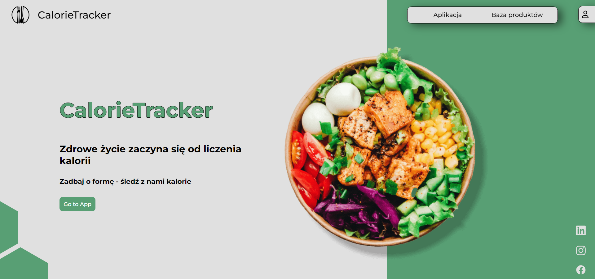
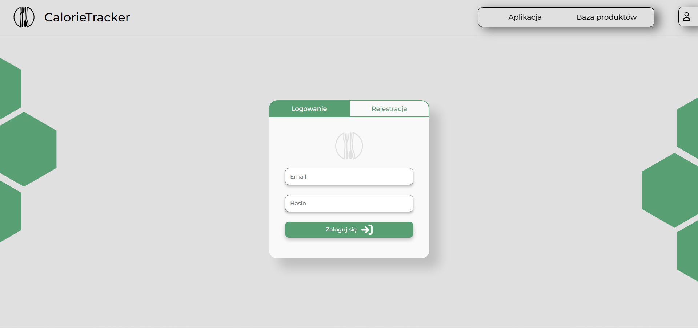
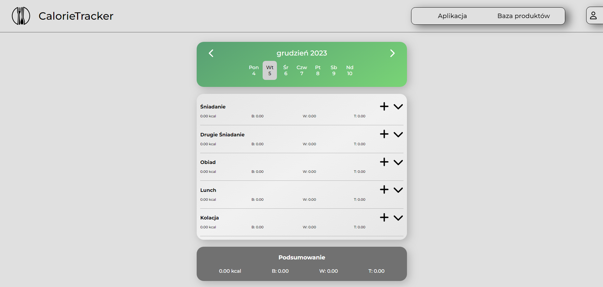

# CalorieTracker

Application designed to help users track their daily calorie intake.
Live demo [CalorieTracker](https://calorie-tracker-kl.netlify.app/).

## Table of Contents

- [General Information](#general-information)
- [Build With](#build-with)
- [Features](#features)
- [Screenshots](#screenshots)
- [Installation](#installation)
- [Roadmap](#roadmap)
- [Contact](#contact)

## General Information

CalorieTracker is an app for users who want to lead a healthy lifestyle. The app helps to monitor the amount of calories consumed. It also allows you to add your own products.

## Build With

- React
- Typescript
- Firebase
- Vite

## Features

- User Authentication
- Calorie Logging
- Food Database
- Adding Custom Products
- Responsive Design
- Multi-language

## Screenshots





## Installation

1.  Contact author for Enviromental Variables.
2.  Clone Github repository:

```sh
 git clone https://github.com/KrzysztofLesiak/calorie_tracker.git
```

3.  Install NPM packages:

```sh
   npm install
```

4. Add .env file with Enviromental Variables in main folder.
5. Start develpoment server:

```sh
   npm run dev
```

## Roadmap

Project is under active development. Future updates may include:

- Selectable units of measurement (g / ml)

## Contact

Author: Krzysztof Lesiak

[LinkedIn](https://www.linkedin.com/in/lesiak-krzysztof/) |
[GitHub](https://github.com/KrzysztofLesiak)
